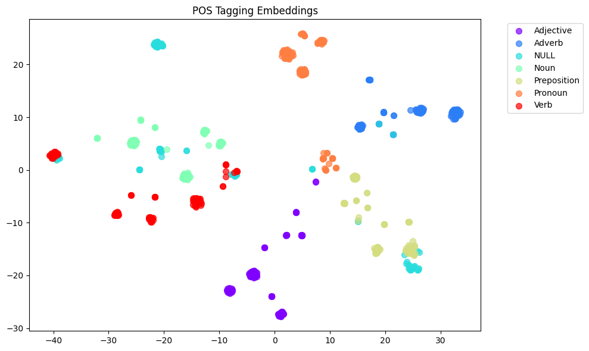

# Concept-Encoding

An unofficial implementation of concept encoding experiments based on the paper ["Emergence of Abstractions: Concept Encoding and Decoding Mechanism for In-Context Learning in Transformers"](paper_link).



## Overview

This repository explores how language models encode concepts internally and how this encoding quality (Concept Decodability) predicts their in-context learning (ICL) performance. We provide tools to:
- Compute concept decodability scores
- Visualize concept encodings
- Analyze different linguistic concepts in LLM representations

## Default Concepts
The implementation includes analysis for basic linguistic concepts:
- Noun
- Verb
- Adjective
- Adverb
- Preposition
- NULL (baseline)

## Getting Started

### Installation
```bash
# Clone the repository
git clone [repo-url]

# Install dependencies
pip install -r requirements.txt
```

### Usage
1. For step-by-step guidance, see `experiment.ipynb`
2. For quick analysis:
```bash
python concept_decode.py
```

## Customization
To analyze different concepts, modify the `concept_examples` in `data.py`.

## Citation
If you use this code, please cite the original paper:
```
[paper citation]
```


